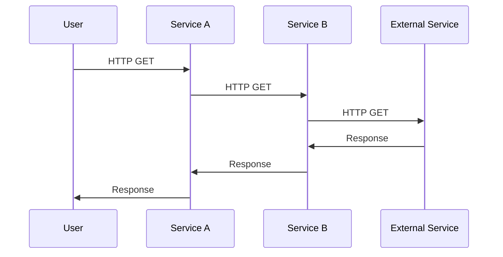

Users outside my team send HTTP requests to Service A, which - depending on the request - sometimes needs data from an external service. The logic for sending requests to the External Service and post-processing the response was in Service B.



## What went wrong?

During work on Service B, I noticed that it used `httpx` for some HTTP requests and `requests` for others. Following the [boy scout rule](https://97-things-every-x-should-know.gitbooks.io/97-things-every-programmer-should-know/content/en/thing_08/), I decided to remove this inconsistency by getting rid of the dependency on `requests` and perform the requests with `httpx` instead. The requests were fairly simple; it looked like drop-in replacement:

```diff
- response = requests.post(url, data=payload)
+ response = httpx.post(url, data=payload)
```

However, soon after deploying these changes, the failure rate of requests to Service A started to go up because the requests Service B made to the External Service were timing out.

Some debugging later, I found out that **`httpx` has a default timeout of 5 seconds, whereas `requests` has not**.

The documentation of `httpx` is actually quite clear about this: [The default behavior is to raise a `TimeoutException` after 5 seconds of network inactivity.](https://www.python-httpx.org/advanced/timeouts/); I just hadn't considered this difference in default behaviors.
