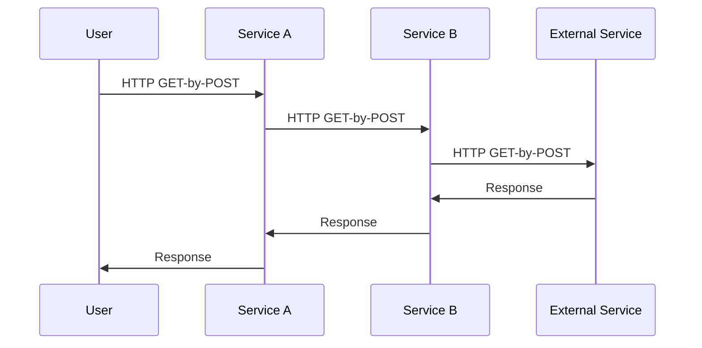
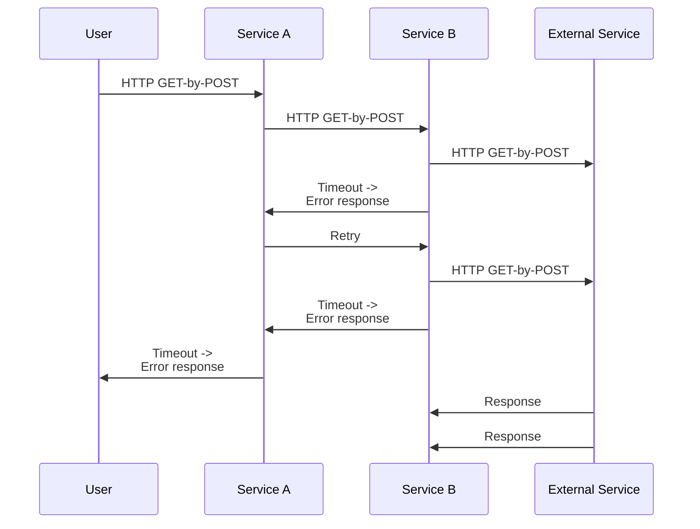

How an innocent-looking migration to a different HTTP library broke our microservice system.

## Setting the scene

Users outside my team send HTTP requests to Service A, which - depending on the request - sometimes needs data from the External Service. The logic for sending requests to the External Service and post-processing the response lives in Service B. Dependencies of Service A (including the External Service) do quite a bit of heavy lifting, so requests to it can take a while. Therefore, the timeouts for requests to Service A were set to 25 seconds at the time.



("GET-by-POST" here means that the user or service wants to retrieve a resource, but uses the POST method, specifying the resource in the request body. This approach allows for more elaborate requests than would be possible with GET due to URL length restrictions.)

## What went wrong?

During some unrelated work on Service B (written in Python), I noticed that it used `httpx` for some HTTP requests and `requests` for others. Following the [boy scout rule](https://97-things-every-x-should-know.gitbooks.io/97-things-every-programmer-should-know/content/en/thing_08/), I decided to remove this inconsistency by getting rid of the dependency on `requests` and using `httpx` instead. The change looked like it was a drop-in replacement:

```diff
- response = requests.post(url, data=payload)
+ response = httpx.post(url, data=payload)
```

However, soon after deploying these changes, the failure rate of requests to Service A increased because requests Service B made to the External Service were timing out.

Some debugging later, I found out that **`httpx` has a default timeout of 5 seconds, whereas `requests` has not**.

The documentation of `httpx` is quite clear about this: [The default behavior is to raise a `TimeoutException` after 5 seconds of network inactivity.](https://www.python-httpx.org/advanced/timeouts/); I just hadn't considered this difference in default behaviors. Once this became clear, the quick fix we implemented was to disable timeouts for calls from Service B to the External Service, which restored the old behavior.

## How retries made the situation worse

To deal with errors when making HTTP requests, it is common to perform a couple of retries. This can be effective if the error was temporary, like a network hiccup. In this case however, the retries made situation worse.

Retries were implemented in Service A, which would retry the request to Service B if it received an error response. As a result, multiple requests were sent to the External Service before Service A finally timed out, increasing the load on the External Service while the system as a whole failed to serve the user a successful response.



## Beyond the quick fix

Explicity setting relevant defaults could have helped the situation, as it prevents accidental changes in behavior when defaults change.

Another (untested) approach suggested by a colleague is to make the timeout configurable in the request, and let the caller set an appropriate timeout. If Service B's timeout is configured in the request to the External Service, the External Service could at least stop doing its work once it receives the timeout. A service could take the timeout specified in the request, subtract any time it needs to spend on its own processing, and then pass the remaining time as timeout to the next service.

Finally, in a situation like this where a service needs to do so much heavy lifting, maybe synchronous (HTTP) requests aren't the right choice. A system based on a message queue (e.g. Kafka or RabbitMQ) or a job queue (e.g. Celery) might be a better fit.
